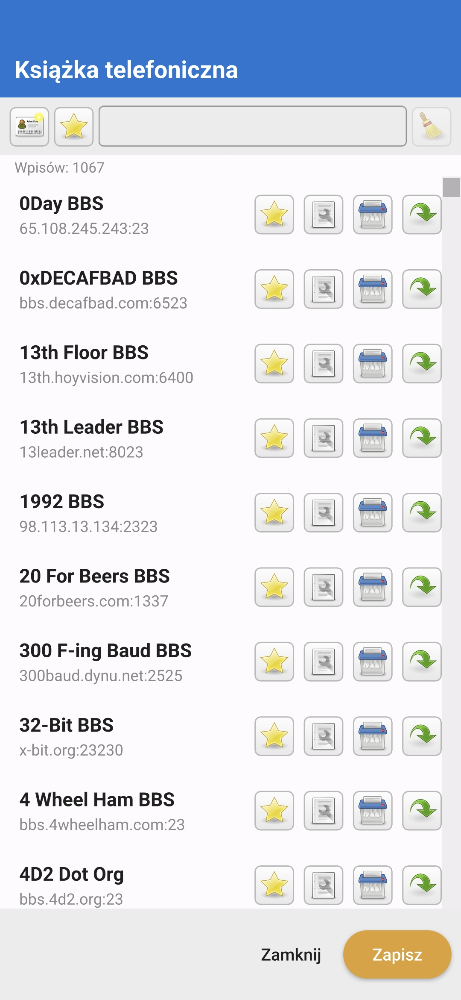
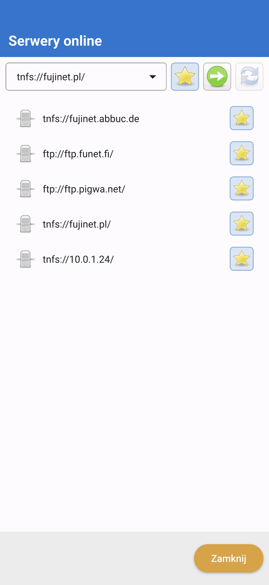
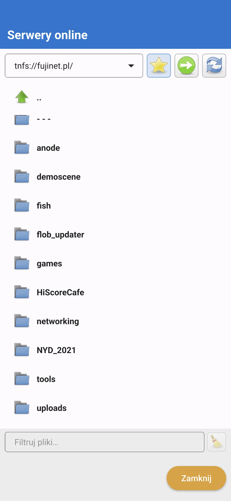
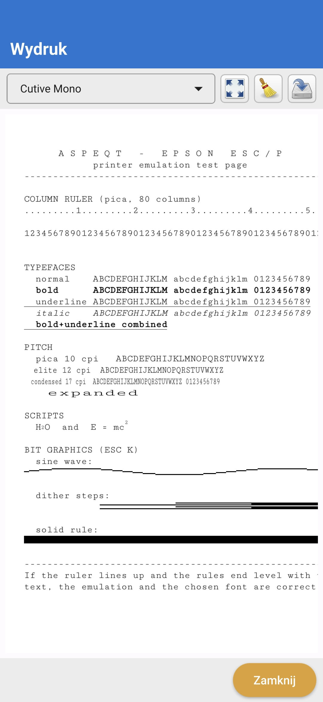

# AspeQt — Atari SIO Peripheral Emulator for Android

**AspeQt** emulates 8-bit Atari SIO peripherals (disk drives, cassette, printer,
PCLINK host access) on Android. It talks to a real Atari through one of two serial
interfaces:

* **SIO2PC-USB** via an FTDI adapter (USB OTG host support is required), or
* **SIO2BT** via a SIO2BT bluetooth dongle, supported by most modern Android devices.

**In version 1.2** the interface was re-created in **Qt Quick / QML** (Material Design):
the same drive-panel layout, but built for touch throughout. The engine behind it
— SIO, mounting, sessions, the cassette and executable loader — is unchanged and
now runs headless, with no widget code left anywhere in the app.

<p align="center">
  
</p>

**What's new in 1.2:**

* **R: device (Atari 850 modem emulation)**: dial BBSes over telnet and SSH, with a
  phonebook, favourites and search; turn your Atari into an SSH terminal (SSH-Shell
  connection type).

<p align="center">
  
</p>
  
* **Network browser**: TNFS, FTP, FTPS and SFTP — mount ATR, CAS and XEX, and
  download files to your device.
* **Epson printer emulation**: print jobs rendered onto a page with bit
  graphics, font choice, PNG and PDF export, and a built-in test page.
* **High-speed atr disk boot over SIO** (device $61 - AtariSIO remote control - disk swapping) on stock/unmodified Atari computers. Mount your atr in D1: and AspeQt will automatically boot Hiass's bundled sioboot-atarisio.atr OS patcher, swap disks and boot your atr image with high speed SIO. Requires "Use high speed disk loader" option in combination with "Use non-standard speeds" POKEY divisor set to 0, or higher typical speed, eg. 57600bps.

<p align="center">
  <a href="src/screenshots/phonebook.jpg"></a>
  <a href="src/screenshots/netbrowser.jpg"></a>
  <a href="src/screenshots/netbrowser2.jpg"></a>
  <a href="src/screenshots/printer.jpg"></a>
</p>

<p align="center"><sub>Phonebook · network browser · Epson printer output — click to enlarge</sub></p>

### Dynamic drive slots

* You start with **5 drive slots** and can add more with the **`+`** row at the
  bottom — up to the hardware limit of **15** (device numbers `D1:`–`D15:`).
* To remove a slot, empty it first (its **eject** button turns into a **red ✗**);
  pressing it again drops that slot. Removing a slot **never renumbers the
  others**, so the drive numbers your DOS expects stay put.
* When the slots don't all fit on screen the list **scrolls with your finger**.
* The **number and contents of the slots are saved** in the default session and
  in any session you save to a file, so your setup is restored on the next start.

### CAS / XEX loader slot

A dedicated **loader slot sits at the top** of the list and replaces the old
"Boot executable" / "Play cassette" menu entries:

* The **load** button (gear icon) opens a file picker for Atari programs
  (`.xex` / `.com` / `.exe`) and cassette images (`.cas`).
* An **executable** is booted straight into the Atari using autoboot loader; the
  slot fills up as a progress bar while the program loads.
* A **cassette** arms the **play** button — do whatever your Atari needs
  (`CLOAD`, or reboot holding *Option*+*Start*) and, when you hear the beep, press
  **play** while pressing a key on the Atari. The slot shows the tape length,
  e.g. *Cassette (5:05)*, and fills as it plays.
* **retry** re-runs the last load, **eject** stops playback / boot and clears the slot.

### High-speed DOS for mounted folders

When you mount a **folder** as a virtual disk, the third slot button turns into a
hard-disk icon labelled **DOS**. Tapping it copies **MyPicoDOS** (`$boot.bin` +
`picodos.sys`) into the folder — MyPicoDOS boots at high speed without any OS
modifications and is a great `.xex` loader too.

## SIO2PC-USB

* Software command-frame detection (**SOFT**, the default handshake method) works
  with anything at 19200 bps and behaves very well at non-standard speeds and with
  the POKEY divisor set to, say, 0 or 1 (SOFT mode is faster).
* Try binary-file loading with the **"use high-speed executable loader"** option
  turned on.

### Software requirements

1. An Android device with USB host support.
2. An OTG cable.
3. A SIO2PC-USB converter — the one [made by Lotharek](https://lotharek.pl/productdetail.php?id=108) is recommended.
4. **No root required.**
5. **No drivers required** — the [usb-serial-for-android](https://github.com/greblus/usb-serial-for-android)
   Java driver is bundled.
6. Connecting a SIO2PC-USB adapter launches AspeQt automatically. With Lotharek's
   adapter, start with the **DSR** or **SOFT** flow-control method at **19200 bps**
   to confirm it works, then experiment with higher speeds and POKEY divisors
   (a high-speed OS, QMEG or DOS/loader is required for the fast SIO routines).

## SIO2BT

My favourite SIO2BT devices are available from
[Marcin "The Montezuma" Sochacki](https://www.facebook.com/Sio2bt/), or you can
build your own following [this simple diagram](http://atarionline.pl/cn/data/upimages/bluetooth_03.jpg).

**The U1MB [PBI BIOS](http://atari8.co.uk/firmware/) supports higher baud rates,
up to 57600 bps, and SIO2BT can work with an unmodified Atari OS.**

Pair your Android device with the SIO2BT dongle and enter the name of your
bluetooth device in the Options window.

On an unmodified Atari, SIO2BT requires a
[special loader](http://abbuc.de/~montezuma/SIO2BT.zip) or a modified OS (with the
ACK timeout increased). Speed, name and PIN can be configured with
[BTCONFIG](http://www.mr-atari.com/Mr.Atari/SIO2BT/BTCONFIG.XEX) by Mr Atari, or
[BTCFG](http://atariage.com/forums/index.php?app=core&module=attach&section=attach&attach_id=468608) by FJC.

## Downloads

* **AspeQt** is on [Google Play](https://play.google.com/store/apps/details?id=org.greblus.AspeQt).
* All releases (including older ones) are on the [releases page](https://github.com/greblus/aspeqt/releases).

## Under the hood

The 1.2 release also cleared out a lot of history. The UI is Qt Quick end to end,
so the QtWidgets and print-support modules are gone from the build, along with every
`.ui` form, the old dialogs and the widget-era window handling.

## Files for testing

* `src/printer/epson-test.prn` — a captured print job that exercises every
  typeface, pitch and graphics mode of the Epson emulation. It is also bundled
  into the app: **Options → Printer emulation → Print a test page** renders it
  without an Atari connected. The same screen takes any other `.prn` capture, which is the
  quick way to work on the rendering.
* `src/icet/icet.atr` — the Ice-T terminal, a disk to mount when testing the R:
  device. Boot it, then dial with `ATDT` or from the phonebook.

## Building

Clone shallow unless you actually need the history:

```
git clone --depth 1 https://github.com/greblus/aspeqt.git
```

The repository carries years of prebuilt APKs in its history. They are no longer
in the working tree, but the old commits still reference them, so a plain
`git clone` transfers about 430 MB. `--depth 1` fetches only the tip commit and
gets you the same sources in roughly 2 MB.

Desktop (Linux/macOS/Windows) — qmake, no CMake:

```
qmake src/aspeqt.pro
make
```

For Android, open `src/aspeqt.pro` in Qt Creator with an Android Qt 6.x kit and
build from there.

## Where to get the adapters

For SIO2BT see the
[SIO2BT ordering thread on AtariAge](http://atariage.com/forums/topic/241984-sio2bt-ordering-thread/),
or build your own.

## License

See `src/license.txt` for the full text.

* Original code up to version 0.6.0 — Copyright 2009 by Fatih Aygün.
* Updates since v0.6.0 — Copyright 2012 by Ray Ataergin.
* Android port of aspeqt-1.0.0.Preview_6 by Wiktor Grębla.

You may freely copy, use, modify and distribute it under the **GPL 2.0** license.

### Credits

* Qt libraries — Copyright by The Qt Company.
* usb-serial-for-android (with FTDI support) is based on
  [mik3y/usb-serial-for-android](https://github.com/mik3y/usb-serial-for-android).
* [Tango Icons](http://tango.freedesktop.org/Tango_Icon_Library).
* The high-speed code used in the EXE loader was written by Matthias Reichl —
  <http://www.horus.com/~hias/atari/>.
* PCLINK by TheMontezuma — <https://github.com/TheMontezuma/RespeQt>.
* R: device / Atari 850 emulation, Epson printer, network file-system clients,
  TNFS FTP (-FTPS), SSH transport, SFTP and SFTP browsing were derived from AspeQt-2k26
  by Paul Jones — <https://github.com/pjones1063/AspeQt-2k26>.
* 850 handler firmware from [Altirra](https://www.virtualdub.org/altirra.html) by
  Avery Lee — see `src/AUTHORS.txt` for more info.
* Ice-T (`src/icet/icet.atr`), the Atari terminal used to test the R: device, is
  by Itay Chamiel.

